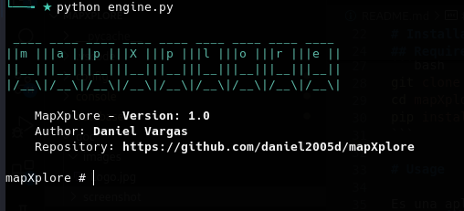

# mapXplore

[Español](doc/es/README.md)


**mapXplore** is a modular application that imports data extracted of the sqlmap to PostgreSQL or SQLite database.

Its main features are:

* Import of information extracted from sqlmap to PostgreSQL or SQLite for subsequent querying.
* Sanitized information, which means that at the time of import, it decodes or transforms unreadable information into readable information.
* Search for information in all tables, such as passwords, users, and desired information.
* Automatic export of information stored in **base64**, such as:
    * Word, Excel, PowerPoint files
    * .zip files
    * Text files or plain text information
    * Images
    * PDF

* Filter tables and columns by criteria.
* Filter by different types of hash functions without requiring prior conversion.
* Export relevant information to Excel or HTML

# Installation

## Requirements
* python-3.11

```
git clone https://github.com/daniel2005d/mapXplore
cd mapXplore
pip install -r requirements
```

# Usage

It is a modular application, and consists of the following:

* **config**: It is responsible for configuration, such as the database engine to use, import paths, among others.
* **import**: It is responsible for importing and processing the information extracted from **sqlmap**.
* **query**: It is the main module capable of filtering and extracting the required information.
    * Filter by tables
    * Filter by columns
    * Filter by one or more words
    * Filter by one or more hash functions within which are:
        * MD5
        * SHA1
        * SHA256
        * SHA3
        * ....

### Beginning
> Allows loading a default configuration at the start of the program
```
python engine.py [--config config.json]
```


## Modules

- [config](doc/en/configuration.md)
- [import](doc/en/import.md)
- [principal|search](doc/en/main.md)

# Change Log

## 14.03.2024  - V1.1

* Error adjustments when reading PPTX files
* 'tables' command added to retrieve tables with the total number of records*
* Add support for ~ added in file paths
* Create subfolder for each file type
* Add Colors to command prompt
* Save file with row data 

## 18.03.2024 - V1.2

* JSON format for storage has been added.
* Option to retrieve databases, tables, and records from a table has been added.
* Cleaning of printable but garbage characters upon reading has been added.
* Some errors are fixed.

## 20.03.2024 - V1.3

* The option *includeAllColumns* is added within the configuration.
* Some errors are fixed.