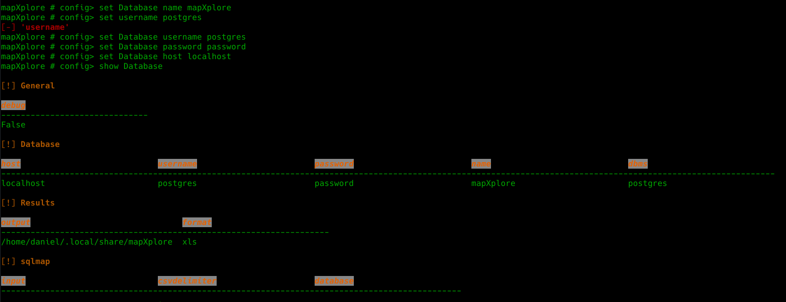

```json
setting = {
        
        "General":{
            "debug":False
        },
        "Database":{
            "host":"",
            "username":"",
            "password":"",
            "name":"",
            "dbms":"postgres|sqlite"
        },
        "Results":{
            "output":"",
            "format":'xls|html'
            
        },
        "sqlmap":{
            "input":"/home/daniel/.local/share/sqlmap/hacked.com",
            "csvdelimiter":",",
            "database":""
        }
    }
```

## config
```json
mapXplore #> use config [General|Database|Results|sqlmap]
```
#### General
This configuration section is used for debugging purposes in case you want to know the details of each execution.
#### Database

This section has the configuration of the database connection where the information will be imported and to which it will connect to perform the search. It has the following options:

* **host**: IP/Host of the postgres database server. (Only applies to postgres)
* **username**: Username to connect with the dbms. (Only applies to postgres)
* **password**: User password. (Only applies to postgres)
* **name**: Name of the database to connect to.
* **dbms**: Specifies the type of dbms to use, the only options are: *postgres and sqlite*

### Results

It is used to configure the output options when performing searches.

* **output**: Output directory where all generated files will be stored.
* **format**: Default format for storing results. Possible values are *html* and *xls*

### sqlmap

This configuration section is used to read the data generated by sqlmap.

* **input**: It is the path where the files generated by sqlmap are stored. Generally, it is the name of the site that was exfiltrated.
> Important: It must be without the dump folder, this is added by the application.
* **csvdelimiter**: List delimiter
* **database**: Name of the database or subfolder that you want to **import**, if left blank it will take all subfolders

## Usage
### Modifiers
* **set** [Database|Results|sqlmap|General] *option* *value*
* **unset** [Database|Results|sqlmap|General] *option*
* **save** configfile.json
* **load** configfile.json

```bash
mapXplore #> use config 
mapXplore # config> show
mapXplore # config> set Database|Results|General|sqlmap option value

mapXplore #> use config Database
mapXplore # config> show
````


