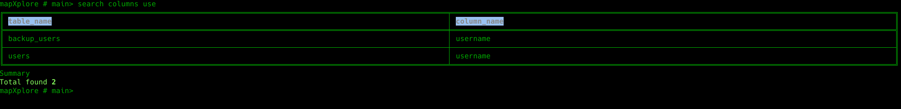
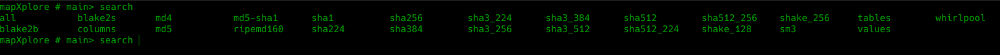
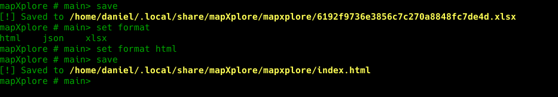
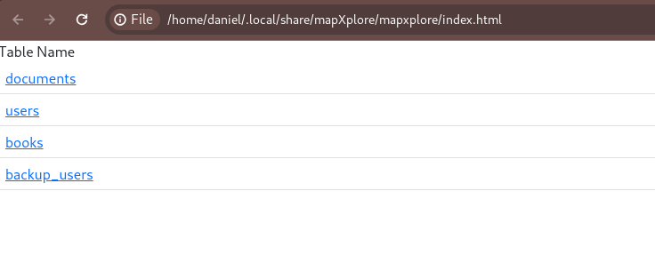

# Main

The main module is not a submodule itself; it is accessed directly from the beginning. This module is designed to perform queries on data that has been previously imported. It's important to configure the *Database* section through the [configuration](configuration.md) module.

This module allows you to perform searches by:
* 1 or multiple words separated by comma (,).
* Tables
* Columns
* HASH (MD5, SHA1, SHA3, SHA256, etc)

## Usage
### Modifiers
* **search**
* **save**: Saves the results in Excel or HTML format as specified in the [configuration](configuration.md).
* **set**: Sets the [configuration](configuration.md) of the Results section.

### Search by Tables
```json
mapXplore #> search tables users
```


### Search by Columns
```json
mapXplore #> search columns user
```


### Search by Words


```json
mapXplore #> search password
mapXplore # search md5 password
```


```bash
mapXplore # search report
```


### Get Databases

```
mapXplore # databases
```

### Get Tables

```
mapXplore # tables
```

### Get all records from a table

```
mapXplore # select <users>
```

### Save

Allows saving the previously searched results in the format defined in the configuration.

```bash
mapXplore # save
```



