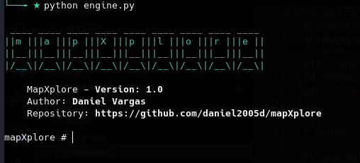

# mapXplore

[English](../../README.md)


**mapXplore** es una aplicación modular, que importa los datos extraidos de sqlmap, a una base de datos postgres o sqlite.

Sus principales caracteristicas son:

* Importación de información extraida de sqlmap a postgres o sqlite para su posterior consulta.
* Información sanitizada, lo que significa que al momento de importar esta se decodifica o transforma información no legible a información legible.
* Búsqueda de información en todas las tablas, como es el caso de contraseñas, usuarios e información que asi se desee.
* Exportación automatica de información almacenada en **base64**, como pueden ser:
    * Archivos Word, Excel, Powerpoint
    * Archivos .zip
    * Archivos de texto o información en texto plano
    * Imágenes
    * PDF

* Filtrar tablas y columnas por criterios.
* Filtrar por diferentes tipos de funciones hash sin requerir su previa conversión.
* Exportar la información relevante a Excel, HTML y JSON

# Instalación

## Requrimientos
* python-3.11

```
git clone https://github.com/daniel2005d/mapXplore
cd mapXplore
pip install -r requirements
```

# Uso

Es una aplicación que es modular, y consta de lo siguiente:

* **config**: Se encarga de la configuración, como motor de base de datos a usar, rutas de importación entre otros.
* **import**: Se encarga de realizar la importación y tratamiento de la información extraida de **sqlmap**
* **query**: Es el modulo principal capaz de filtrar y extraer la información que se requiere.
    * Filtro por tablas
    * Filtro por columnas
    * Filtro por una o varias palabras
    * Filtro por una o varias funciones Hash dentro de las cuales se encuentran:
        * MD5
        * SHA1
        * SHA256
        * SHA3
        * ....

### Inicio
> Permite cargar una configuración por defecto al inicio del programa

```
python engine.py [--config config.json]
```


## Modulos

- [config](configuration.md)
- [import](import.md)
- [principal|search](main.md)


# Cambios

## 14.03.2024  - V1.1

* Corrección de errores al leer PPTX
* Se añade el comando 'tables' para obtener las tablas con el total de registros.
* Se añade soporte para ~ en la ruta de los archivos
* Crear subcarpeta por cada tipo de archivo
* Adiciona colores al command prompt
* Guarda los archivos con datos de la fila que esta consultando.

## 18.03.2024 - V1.2

* Se adiciona el formato JSON para almacenar
* Se adiciona la opción para obtener las bases de datos, tablas y registros de una tabla.
* Se adiciona la limpieza de caracteres que son imprimibles pero son basura al momento de leer.
* Se corrigen algunos errores.

## 20.03.2024 - V1.3

* Se adiciona la opción *includeAllColumns* dentro de la configuración.
* Se corrigen algunos errores.

## 03.04.2024 - V1.4

* Se adiciona la opción *export* para guardar el contenido de la base de datos en HTML