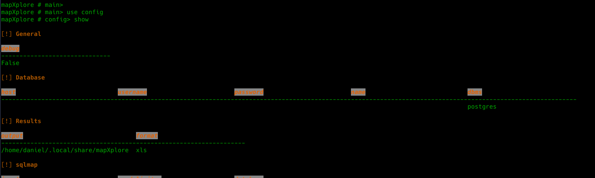
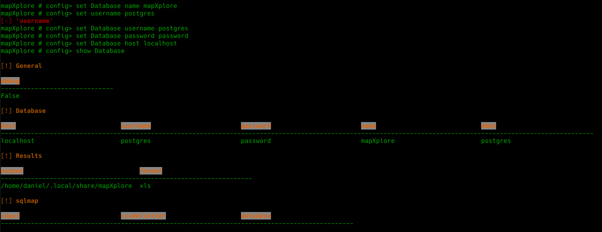

# Configuración
```json
setting = {
        
        "General":{
            "debug":False
        },
        "Database":{
            "host":"",
            "username":"",
            "password":"",
            "name":"",
            "dbms":"postgres|sqlite"
        },
        "Results":{
            "output":"",
            "format":'xls|html'
            
        },
        "sqlmap":{
            "input":"/home/daniel/.local/share/sqlmap/hacked.com",
            "csvdelimiter":",",
            "database":""
        }
    }
```

## config
```json
mapXplore #> use config [General|Database|Results|sqlmap]
```
#### General
Esta sección de configuración es usada para efectos de depuración en caso que se desee conocer el detalle de cada ejecución.
#### Database

Esta sección tiene la configuración de la conexión de la base de datos en donde se importara la información y a la cual se conectara para realizar la búsqueda. Tiene las siguientes opciones:

* **host**: IP/Host del servidor de base de datos de postgres. (Unicamente aplica para postgres)
* **username**: Nombre de usuario para conectarse con el dbms. (Unicamente aplica para postgres)
* **password**: Contraseña del usuario. (Unicamente aplica para postgres)
* **name**: Nombre de la base de datos a conectarse.
* **dbms**: Especifica el tipo de dbms a usar, las únicas opciones son: *postgres y sqlite*

### Results

Es usada para configurar las opciones de salida al momento de realizar las búsquedas.

* **output**: Directorio de salida donde se almacenaran todos los archivos generados.
* **format**: Formato por defecto para almacenar los resultados. Los posibles valores son *html* y *xls*

### sqlmap

Esta sección de configuración es usada para leer los datos generados por sqlmap.

* **input**: Es la ruta donde se encuentran almacenados los archivos generados por sqlmap. Generalmente es el nombre del sitio que se exfiltro.
> Importante: Debe ser sin la carpeta dump, esta es adicionada por la aplicación.
* **csvdelimiter**: Delimitador de listas
* **database**: Nombre de la base de datos o subcarpeta que se desea **importar**, si se deja en blanco tomara todas las subcarpetas

## Uso
### Modificadores
* **set** [Database|Results|sqlmap|General] *option* *value*
* **unset** [Database|Results|sqlmap|General] *option*
* **save** configfile.json
* **load** configfile.json

```bash
mapXplore #> use config 
mapXplore # config> show
mapXplore # config> set Database|Results|General|sqlmap option value

mapXplore #> use config Database
mapXplore # config> show
````



