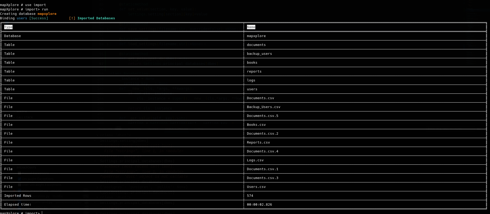

# Import

Importa los datos generados por **Sqlmap** según el dbms seleccionado.

```json
mapXplore #> use import
mapXplore # import> run
```


> En caso que la aplicación detecte algún tipo de dato como base64 intentara extraer la información y en caso de ser algún archivo soportado este lo almacenara en la carpeta por defecto $HOME/.local/share/mapXplore/<database>/files

## Archivos Soportados
* Word
* Excel
* Powerpoint
* Texto plano
* PDF
* ZIP

