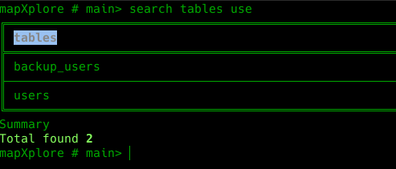
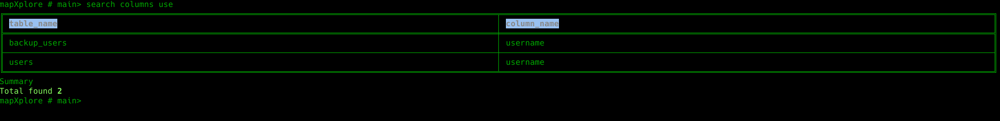
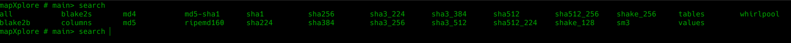
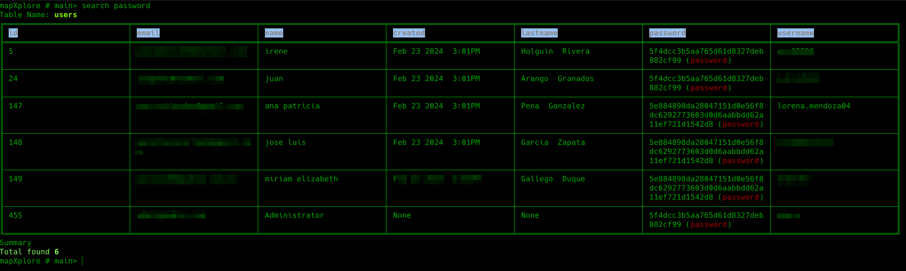
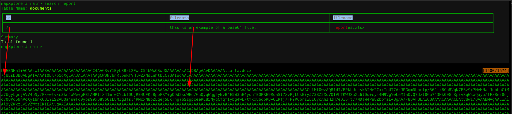
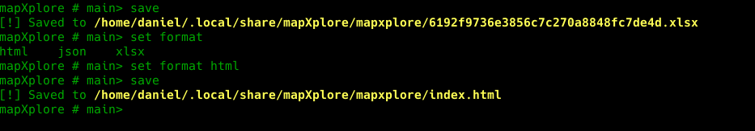
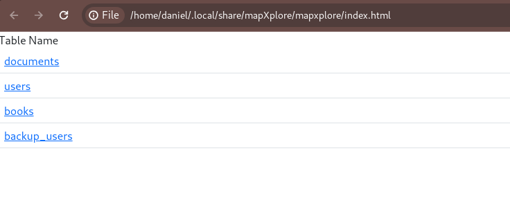
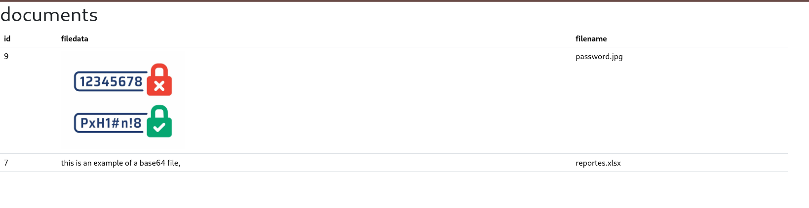

# Main

El modulo principal no es un submodulo como tal, se accede directamente desde el inicio.
Este modulo esta diseñado para realizar las consultas antes importadas. Se debe tener presente que se debe configurar la seccion *Database* por medio del modulo de [configuración](configuration.md).

Este modulo permite realizar las búsquedas por:
* 1 o varias palabras separadas por coma (,).
* Tablas
* Columnas
* HASH (MD5, SHA1,SHA3, SHA256, etc)

## Uso
### Modificadores
* **search**
* **save**: Guarda los resultados en excel o HTML según el formato especificado en la  [configuración](configuration.md)
* **set**: Establece la [configuración](configuration.md) de la section de Results.
* **export**: Exporta el contenido de la base de datos en un archivo HTML navegable.
### Buscar por tablas
```
mapXplore #> search tables users
```


### Buscar por columnas
```
mapXplore #> search columns user
```


### Buscar por palabras


```
mapXplore #> search password
mapXplore # search md5 password
```


```
mapXplore # search report
```



### Obtener Bases de datos

```
mapXplore # databases
```

### Obtener tablas

```
mapXplore # tables
```

### Obtener todos los registros de una tabla

```
mapXplore # select <users>
```

### Guardar

Permite guardar los resultados antes buscados en el formato que se defina en la configuración.

```
mapXplore # save
```





### Export

Exporta el contenido de la base de datos en un archivo HTML navegable.
** --limit: [opcional] Establece el número de filas a exportar. Por defecto es **10**.

```
mapXplore # export [--limit default 10]
```